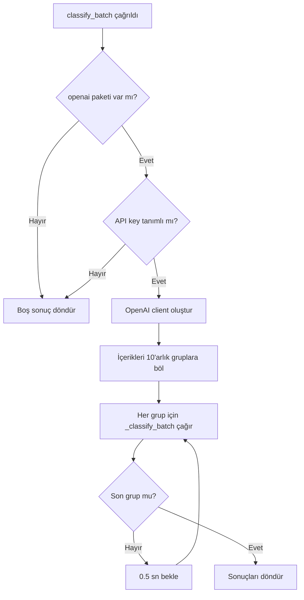
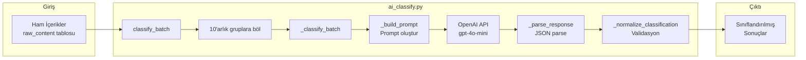

# 🤖 [ai_classify.py](file:///c:/Users/bayra/Desktop/tel-pipline-scraping/scraping/ai_classify.py) — Detaylı Kod Açıklaması

Bu dosya, Telegram kanallarından toplanan ham içerikleri **OpenAI GPT modeli** kullanarak otomatik olarak sınıflandıran bir modüldür. Aşağıda her bölüm tane tane açıklanmıştır.

---

## 📦 1. Modül Docstring'i (Satır 1–19)

```python
"""
AI Extract + Classify
======================
raw_content tablosundaki ham icerigi siniflandirir.
...
"""
```

Bu kısım **modülün ne yaptığını** açıklayan bir döküman stringidir. Python'da `"""` ile başlayan bu yorum blokları, dosyanın amacını, kullanım şeklini ve gereksinimlerini belgeler. Burada şunlar anlatılıyor:

| Alan | Açıklama |
|------|----------|
| `is_relevant` | İçerik belirtilen coin hakkında mı? |
| `content_type` | İçeriğin türü (haber, duyuru, olay, FUD vb.) |
| `sentiment` | Duygu durumu (olumlu, olumsuz, nötr) |
| `event_type` | Varsa olay türü (listeleme, ortaklık, güncelleme...) |
| `event_date` | Olayın tarihi |
| `summary` | Kısa özet |
| `importance` | Önem derecesi (yüksek, orta, düşük) |

---

## 📥 2. Import'lar ve Logger (Satır 21–26)

```python
import os
import json
import time
import logging

log = logging.getLogger(__name__)
```

| Modül | Ne İşe Yarıyor? |
|-------|-----------------|
| `os` | Çevre değişkenlerini okumak için (`OPENAI_API_KEY`) |
| `json` | LLM'den dönen JSON yanıtını parse etmek için |
| `time` | Batch'ler arası bekleme süresi koymak için (`time.sleep`) |
| `logging` | Uyarı ve hata mesajlarını loglamak için |

`logging.getLogger(__name__)` → Bu modülün kendi adıyla bir logger oluşturur. Böylece log mesajlarında hangi dosyadan geldiği belli olur (örn: `scraping.ai_classify`).

---

## ⚠️ 3. OpenAI Paket Kontrolü (Satır 28–34)

```python
try:
    import openai
    OPENAI_OK = True
except ImportError:
    OPENAI_OK = False
    log.warning("⚠  openai paketi bulunamadi. ...")
```

### Ne yapıyor?
Bu bir **güvenli import** (safe import) desenidir:

1. `try` bloğunda `openai` paketi import edilmeye çalışılır.
2. **Başarılıysa**: `OPENAI_OK = True` → API kullanılabilir.
3. **Başarısızsa** (`ImportError`): `OPENAI_OK = False` → Program çökmez, sadece uyarı verir.

> [!TIP]
> Bu desen, opsiyonel bağımlılıklar için çok yaygındır. Paket yoksa program düzgün şekilde degrade olur (graceful degradation).

---

## ⚙️ 4. Sabitler (Satır 36–38)

```python
_MODEL      = "gpt-4o-mini"   # Hızlı ve ekonomik
_TIMEOUT    = 30
_BATCH_SIZE = 10   # Her LLM çağrısında kaç içerik
```

| Sabit | Değer | Açıklama |
|-------|-------|----------|
| `_MODEL` | `"gpt-4o-mini"` | Kullanılacak OpenAI modeli. Mini versiyon hem hızlı hem ucuzdur. |
| `_TIMEOUT` | `30` | API çağrısı için zaman aşımı (saniye). |
| `_BATCH_SIZE` | `10` | Tek bir API çağrısında kaç içerik gönderileceği. |

> [!NOTE]
> Alt çizgi (`_`) ile başlayan isimler Python'da **"bu değişken modül dışından kullanılmasın"** anlamına gelir. Bir konvansiyon (naming convention) olarak private/internal olduğunu belirtir.

---

## 🚀 5. Ana Fonksiyon: [classify_batch](file:///c:/Users/bayra/Desktop/tel-pipline-scraping/scraping/ai_classify.py#45-85) (Satır 45–84)

```python
def classify_batch(items: list[dict], symbol: str,
                   name: str = None) -> list[dict]:
```

### Parametreler

| Parametre | Tip | Açıklama |
|-----------|-----|----------|
| `items` | `list[dict]` | Sınıflandırılacak ham içerik listesi (her biri bir dict) |
| `symbol` | `str` | Coin sembolü (örn: `"PEPE"`) |
| `name` | `str` (opsiyonel) | Coin'in tam adı (örn: `"Pepe"`) |

### Dönüş Değeri
Her içerik için sınıflandırma sonucu içeren bir `list[dict]` döner.

### Akış Şeması



### Satır Satır Açıklama

```python
if not OPENAI_OK:
    log.warning("[Classify] openai paketi yok, ham veri donduruluyor.")
    return [_empty_result(item) for item in items]
```
→ OpenAI paketi yoksa, her item için **boş sınıflandırma** döndürür. Program kırılmaz.

```python
api_key = os.environ.get("OPENAI_API_KEY")
if not api_key:
    log.warning("[Classify] OPENAI_API_KEY tanimlanmamis, atlaniyor.")
    return [_empty_result(item) for item in items]
```
→ Çevre değişkeninden API key'i okur. Yoksa yine boş sonuç döner.

```python
client = openai.OpenAI(api_key=api_key)
```
→ OpenAI istemcisi (client) oluşturulur. Bu nesne üzerinden API çağrıları yapılır.

```python
for i in range(0, len(items), _BATCH_SIZE):
    batch = items[i:i + _BATCH_SIZE]
    batch_results = _classify_batch(client, batch, symbol, name or symbol)
    results.extend(batch_results)
    if i + _BATCH_SIZE < len(items):
        time.sleep(0.5)
```

Bu döngü **toplu işleme (batching)** mantığıdır:

1. `range(0, len(items), 10)` → 0, 10, 20, 30... şeklinde ilerler.
2. `items[i:i+10]` → Her seferinde 10'ar item'lık dilim alır.
3. [_classify_batch()](file:///c:/Users/bayra/Desktop/tel-pipline-scraping/scraping/ai_classify.py#91-129) → Bu dilimi API'ye gönderir.
4. `results.extend()` → Dönen sonuçları ana listeye ekler.
5. `time.sleep(0.5)` → Son batch değilse 0.5 saniye bekler (**rate limiting**).

> [!IMPORTANT]
> `name or symbol` ifadesi: Eğer `name` parametresi `None` veya boş string ise, yerine `symbol` değerini kullanır. Python'da [or](file:///c:/Users/bayra/Desktop/tel-pipline-scraping/scraping/ai_classify.py#175-192) operatörü ilk truthy değeri döndürür.

---

## 🔧 6. İç Fonksiyon: [_classify_batch](file:///c:/Users/bayra/Desktop/tel-pipline-scraping/scraping/ai_classify.py#91-129) (Satır 91–128)

```python
def _classify_batch(client, items: list[dict],
                    symbol: str, name: str) -> list[dict]:
```

Bu fonksiyon **tek bir API çağrısı** ile bir grup içeriği sınıflandırır.

### Adım 1: İçerik Listesini Hazırla (Satır 96–102)

```python
content_list = []
for idx, item in enumerate(items):
    title = item.get("title") or ""
    body  = (item.get("body") or "")[:300]  # Maliyet kontrolü
    content_list.append(
        f"[{idx}] TITLE: {title}\nBODY: {body}"
    )
```

- `enumerate(items)` → Her item'a bir index numarası verir (0, 1, 2...).
- `item.get("title") or ""` → Güvenli erişim. Key yoksa veya `None` ise boş string kullanır.
- `[:300]` → Body metnini **300 karakterle sınırlar**. Bu, API maliyetini kontrol altında tutar.
- Her içerik `[0] TITLE: ... BODY: ...` formatında hazırlanır.

### Adım 2: Prompt Oluştur ve API'ye Gönder (Satır 104–113)

```python
prompt = _build_prompt(symbol, name, content_list)

response = client.chat.completions.create(
    model=_MODEL,
    max_tokens=2000,
    messages=[{"role": "user", "content": prompt}],
)
raw = response.choices[0].message.content
parsed = _parse_response(raw, len(items))
```

- [_build_prompt()](file:///c:/Users/bayra/Desktop/tel-pipline-scraping/scraping/ai_classify.py#131-155) → LLM'e gönderilecek prompt'u oluşturur.
- `client.chat.completions.create()` → **OpenAI Chat API** çağrısı.
  - `model` → Hangi model kullanılacak.
  - `max_tokens=2000` → Yanıttaki maksimum token sayısı.
  - `messages` → Chat formatında mesaj listesi.
- `response.choices[0].message.content` → API yanıtının metin içeriği.

### Adım 3: Hata Yönetimi (Satır 114–116)

```python
except Exception as e:
    log.error(f"[Classify] API hatasi: {e}")
    return [_empty_result(item) for item in items]
```

API çağrısı başarısız olursa (ağ hatası, rate limit vb.), hata loglanır ve **boş sonuçlar** döner. Program çökmez.

### Adım 4: Sonuçlara `content_id` Ekle (Satır 118–128)

```python
results = []
for idx, item in enumerate(items):
    if idx < len(parsed):
        result = parsed[idx]
    else:
        result = _empty_classification()
    result["content_id"] = item.get("id")
    results.append(result)
```

- Parse edilen sonuçlar ile orijinal item'lar eşleştirilir.
- Her sonuca `content_id` eklenir (veritabanı kaydıyla ilişkilendirme için).
- API'den beklenen sayıda sonuç gelmezse, eksikler için boş sınıflandırma kullanılır.

---

## 📝 7. Prompt Oluşturma: [_build_prompt](file:///c:/Users/bayra/Desktop/tel-pipline-scraping/scraping/ai_classify.py#131-155) (Satır 131–154)

```python
def _build_prompt(symbol: str, name: str,
                  content_list: list[str]) -> str:
    items_text = "\n\n".join(content_list)
    return f"""Sen bir kripto para haber analiz uzmanısın.
Asagidaki iceriklerin her biri {name} ({symbol}) coin'i hakkinda mi diye degerlendirmeni istiyorum.
...
Sadece JSON dizisini don, baska aciklama ekleme."""
```

### Ne yapıyor?
GPT modeline gönderilecek **sistem talimatını** (prompt) oluşturur. Bu bir **f-string** (format string) ile yapılır.

### Prompt'un yapısı:

| Bölüm | İçerik |
|-------|--------|
| **Rol tanımı** | "Sen bir kripto para haber analiz uzmanısın" |
| **Görev** | İçeriklerin belirtilen coin hakkında olup olmadığını değerlendir |
| **Çıktı formatı** | JSON schema (hangi alanlar, hangi değerler) |
| **İçerikler** | Analiz edilecek metinler |
| **Son talimat** | "Sadece JSON dizisini dön, başka açıklama ekleme" |

> [!TIP]
> **Prompt Engineering İpucu**: Modele "sadece JSON dön" demek, gereksiz açıklamaları önler ve parse işlemini kolaylaştırır. Bu, yapılandırılmış çıktı (structured output) almak için yaygın bir tekniktir.

---

## 🔍 8. Yanıt Parse Etme: [_parse_response](file:///c:/Users/bayra/Desktop/tel-pipline-scraping/scraping/ai_classify.py#157-173) (Satır 157–172)

```python
def _parse_response(raw: str, expected_count: int) -> list[dict]:
    start = raw.find("[")
    end   = raw.rfind("]") + 1
    if start == -1 or end == 0:
        raise ValueError("JSON listesi bulunamadi")

    data = json.loads(raw[start:end])
    data.sort(key=lambda x: x.get("idx", 0))
    return [_normalize_classification(d) for d in data]
```

### Adım Adım:

1. **`raw.find("[")`**: Yanıtta ilk `[` karakterini bulur (JSON dizisinin başlangıcı).
2. **`raw.rfind("]") + 1`**: Son `]` karakterini bulur (JSON dizisinin sonu). `+1` çünkü slice son indeksi dahil etmez.
3. **Kontrol**: Eğer `[` veya `]` bulunamazsa hata fırlatır.
4. **`json.loads(raw[start:end])`**: Bulunan JSON string'ini Python listesine çevirir.
5. **`data.sort(...)`**: Sonuçları `idx` alanına göre sıralar (LLM sırayı karıştırabilir).
6. **[_normalize_classification(d)](file:///c:/Users/bayra/Desktop/tel-pipline-scraping/scraping/ai_classify.py#175-192)**: Her sonucu normalize eder (geçersiz değerleri düzeltir).

> [!NOTE]
> LLM bazen JSON'dan önce/sonra açıklama metni ekleyebilir. Bu yüzden `find("[")` ve `rfind("]")` kullanarak sadece JSON kısmını çıkarmak gerekir. Bu, **savunmacı programlama** (defensive programming) örneğidir.

---

## 🛡️ 9. Normalizasyon: [_normalize_classification](file:///c:/Users/bayra/Desktop/tel-pipline-scraping/scraping/ai_classify.py#175-192) (Satır 175–191)

```python
def _normalize_classification(d: dict) -> dict:
    VALID_TYPES      = {"news", "announcement", "event", "fud", "rumor", "other"}
    VALID_SENTIMENT  = {"positive", "negative", "neutral"}
    VALID_EVENT_TYPE = {"listing", "partnership", "upgrade", "burn",
                        "regulatory", "other"}
    VALID_IMPORTANCE = {"high", "medium", "low"}

    return {
        "is_relevant":  bool(d.get("is_relevant", False)),
        "content_type": d.get("content_type", "other") if d.get("content_type") in VALID_TYPES else "other",
        "sentiment":    d.get("sentiment") if d.get("sentiment") in VALID_SENTIMENT else "neutral",
        "event_type":   d.get("event_type") if d.get("event_type") in VALID_EVENT_TYPE else None,
        "event_date":   d.get("event_date"),
        "summary":      str(d.get("summary") or "")[:300],
        "importance":   d.get("importance", "low") if d.get("importance") in VALID_IMPORTANCE else "low",
    }
```

### Ne yapıyor?
LLM'in döndürdüğü değerleri **doğrular ve güvenli hale getirir**. Bu çok önemli bir fonksiyondur çünkü:

- LLM bazen beklenmeyen değerler döndürebilir (yazım hatası, farklı format vb.).
- Bu fonksiyon **whitelist yaklaşımı** kullanır: Sadece izin verilen değerler kabul edilir.

### Her alanın validasyonu:

```
"content_type": d.get("content_type", "other") if d.get("content_type") in VALID_TYPES else "other"
```

Bu satırı parçalayalım:

```
EĞER d["content_type"] geçerli türlerden biriyse → onu kullan
DEĞİLSE → "other" kullan
```

Bu **ternary expression** (üçlü ifade) Python'da `değer_doğruysa if koşul else değer_yanlışsa` şeklinde yazılır.

| Alan | Geçersizse Varsayılan |
|------|----------------------|
| `is_relevant` | `False` |
| `content_type` | `"other"` |
| `sentiment` | `"neutral"` |
| `event_type` | `None` |
| `event_date` | Olduğu gibi kalır |
| `summary` | Boş string (max 300 karakter) |
| `importance` | `"low"` |

---

## 📭 10. Boş Sonuç Fonksiyonları (Satır 194–209)

### [_empty_classification()](file:///c:/Users/bayra/Desktop/tel-pipline-scraping/scraping/ai_classify.py#194-204) (Satır 194–203)

```python
def _empty_classification() -> dict:
    return {
        "is_relevant":  None,
        "content_type": None,
        "sentiment":    None,
        "event_type":   None,
        "event_date":   None,
        "summary":      None,
        "importance":   None,
    }
```

Tüm alanları `None` olan bir sınıflandırma dict'i döner. API çalışmadığında veya hata oluştuğunda kullanılır.

### [_empty_result()](file:///c:/Users/bayra/Desktop/tel-pipline-scraping/scraping/ai_classify.py#206-210) (Satır 206–209)

```python
def _empty_result(item: dict) -> dict:
    r = _empty_classification()
    r["content_id"] = item.get("id")
    return r
```

[_empty_classification()](file:///c:/Users/bayra/Desktop/tel-pipline-scraping/scraping/ai_classify.py#194-204) üzerine `content_id` ekler. Bu, sonucun hangi ham içeriğe ait olduğunu belli eder.

---

## 🏗️ Genel Mimari Özeti



---

## 🎯 Öğrenilen Tasarım Desenleri

| Desen | Nerede Kullanılıyor | Neden Önemli |
|-------|---------------------|--------------|
| **Graceful Degradation** | `try/except ImportError` | Eksik bağımlılıkta çökmez |
| **Batching** | `range(0, len, BATCH_SIZE)` | API maliyetini ve rate limit'i kontrol eder |
| **Rate Limiting** | `time.sleep(0.5)` | API sınırlarını aşmayı önler |
| **Defensive Parsing** | `find("[")`, `rfind("]")` | LLM'in tutarsız çıktılarını ele alır |
| **Whitelist Validation** | [_normalize_classification](file:///c:/Users/bayra/Desktop/tel-pipline-scraping/scraping/ai_classify.py#175-192) | Sadece bilinen değerleri kabul eder |
| **Null Object Pattern** | [_empty_classification](file:///c:/Users/bayra/Desktop/tel-pipline-scraping/scraping/ai_classify.py#194-204) | Hata durumunda tutarlı yapı döndürür |
| **Environment Config** | `os.environ.get()` | Gizli bilgiler koda yazılmaz |
