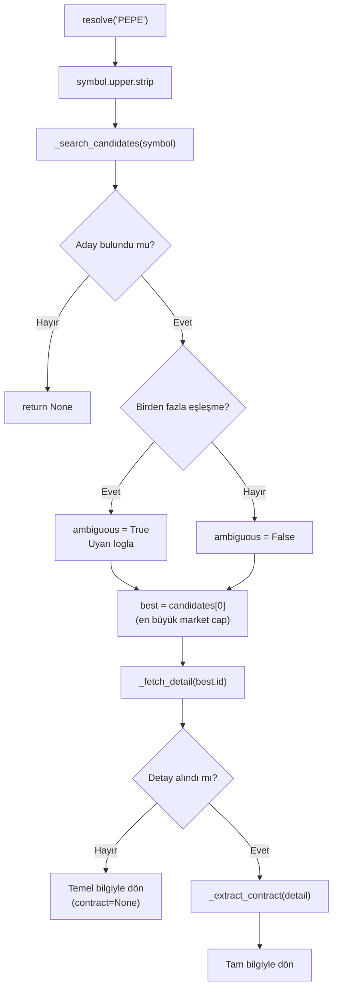
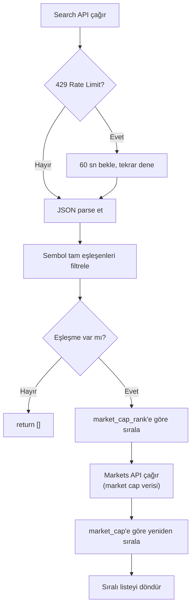
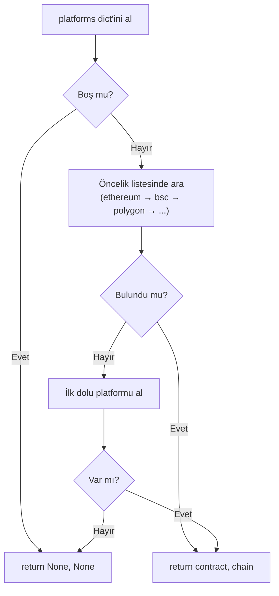
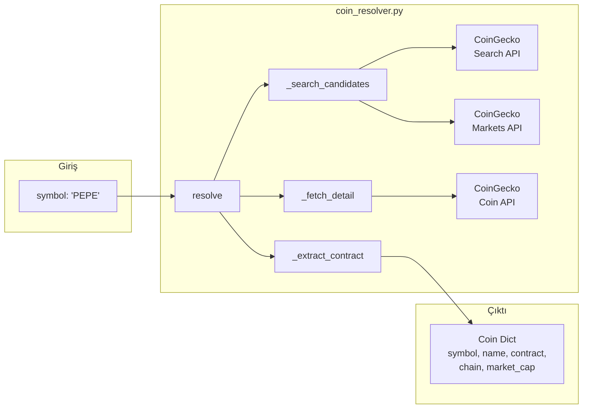

# 🔍 [coin_resolver.py](file:///c:/Users/bayra/Desktop/tel-pipline-scraping/scraping/coin_resolver.py) — Detaylı Kod Açıklaması

Bu modül, verilen bir coin sembolünü (örn: `"PEPE"`) **CoinGecko API** kullanarak çözümler ve o coin'e ait kimlik bilgilerini (isim, contract adresi, blockchain, market cap vb.) döndürür.

---

## 📦 1. Modül Docstring'i (Satır 1–8)

```python
"""
Coin Identity Resolver
========================
Verilen symbol icin CoinGecko'dan gercek kimlik bilgisini ceker.

- Birden fazla eslesme varsa uyari verir, market cap buyugunu alir
- Coin objesi: symbol, name, coingecko_id, contract, chain, market_cap_usd, ambiguous
"""
```

Modülün amacını ve dönen veri yapısını belgeler. Önemli bir detay: Aynı sembolle birden fazla coin olabilir (örn: birçok "PEPE" token'ı var). Bu modül **en büyük market cap'e sahip olanı** seçer.

---

## 📥 2. Import'lar ve Sabitler (Satır 10–21)

```python
import time
import logging
import requests

log = logging.getLogger(__name__)

COINGECKO_SEARCH   = "https://api.coingecko.com/api/v3/search"
COINGECKO_COIN     = "https://api.coingecko.com/api/v3/coins/{id}"
COINGECKO_MARKETS  = "https://api.coingecko.com/api/v3/coins/markets"

_HEADERS = {"Accept": "application/json"}
_TIMEOUT = 12
```

| Değişken | Açıklama |
|----------|----------|
| `time` | API çağrıları arasında bekleme (`sleep`) için |
| `logging` | Log mesajları üretmek için |
| `requests` | HTTP istekleri göndermek için (üçüncü parti kütüphane) |
| `COINGECKO_SEARCH` | Coin arama endpoint'i — sembolle eşleşen coinleri bulur |
| `COINGECKO_COIN` | Tekil coin detay endpoint'i — `{id}` yerine coin ID gelir |
| `COINGECKO_MARKETS` | Market verileri endpoint'i — market cap bilgisi çeker |
| `_HEADERS` | Her istekte gönderilen HTTP header'ları |
| `_TIMEOUT` | İstek zaman aşımı (12 saniye) |

> [!NOTE]
> `COINGECKO_COIN` URL'indeki `{id}` bir **placeholder**'dır. Kullanımda `COINGECKO_COIN.format(id="pepe")` şeklinde gerçek değerle değiştirilir. Bu Python'ın `str.format()` yöntemidir.

---

## 🚀 3. Ana Fonksiyon: [resolve](file:///c:/Users/bayra/Desktop/tel-pipline-scraping/scraping/coin_resolver.py#24-87) (Satır 24–86)

```python
def resolve(symbol: str) -> dict | None:
```

### Parametreler ve Dönüş

| Parametre | Tip | Açıklama |
|-----------|-----|----------|
| `symbol` | `str` | Coin sembolü (örn: `"PEPE"`, `"BTC"`) |
| **Dönüş** | `dict \| None` | Coin bilgisi dict'i veya bulunamazsa `None` |

> [!NOTE]
> `dict | None` sözdizimi Python 3.10+ ile gelen **union type** gösterimidir. "Bu fonksiyon ya bir dict ya da None döner" demektir. Eski yazımı `Optional[dict]` idi.

### Dönen Dict Yapısı

```python
{
    "symbol":         "PEPE",            # Coin sembolü
    "name":           "Pepe",            # Coin tam adı
    "coingecko_id":   "pepe",            # CoinGecko'daki benzersiz ID
    "contract":       "0x6982508...",    # Akıllı kontrat adresi
    "chain":          "ethereum",        # Hangi blockchain'de
    "market_cap_usd": 4_200_000_000,    # Piyasa değeri (USD)
    "ambiguous":      False,             # Birden fazla eşleşme var mıydı?
}
```

### Akış Şeması



### Satır Satır Açıklama

#### Adım 1: Giriş Temizliği (Satır 39–40)
```python
symbol = symbol.upper().strip()
log.info(f"[CoinResolver] {symbol} cozumleniyor...")
```
- `.upper()` → Küçük harfleri büyüğe çevirir (`"pepe"` → `"PEPE"`).
- `.strip()` → Baş ve sondaki boşlukları temizler.
- Bu, kullanıcının `"pepe"`, `" PEPE "` veya `"Pepe"` yazmasından bağımsız olarak tutarlı çalışmayı sağlar.

#### Adım 2: Aday Arama (Satır 42–46)
```python
candidates = _search_candidates(symbol)
if not candidates:
    log.warning(f"[CoinResolver] {symbol} icin sonuc bulunamadi.")
    return None
```
- CoinGecko'dan bu sembole uyan coin listesini çeker.
- Hiç sonuç yoksa `None` döner.

#### Adım 3: Belirsizlik Kontrolü (Satır 48–58)
```python
ambiguous = len(candidates) > 1
if ambiguous:
    names = [f"{c['name']} ({c['id']})" for c in candidates[:5]]
    log.warning(
        f"[CoinResolver] ⚠  '{symbol}' icin {len(candidates)} eslesme bulundu: "
        f"{', '.join(names)}. "
        f"Market cap buyugu secildi: {candidates[0]['name']} ({candidates[0]['id']})"
    )
best = candidates[0]
```

- Birden fazla coin aynı sembolü taşıyabilir (örn: birçok "DOGE" token'ı).
- `ambiguous = True` → Bu bilgi sonuç dict'ine eklenir, böylece çağıran kod durumdan haberdar olur.
- `candidates[:5]` → Log'da en fazla 5 tanesini gösterir (spam önleme).
- `candidates[0]` → Liste market cap'e göre sıralı olduğu için ilk eleman en büyüğüdür.

> [!IMPORTANT]
> **List Comprehension**: `[f"{c['name']} ({c['id']})" for c in candidates[:5]]` ifadesi, her adaydan `"Pepe (pepe)"` formatında bir string listesi oluşturur. Bu, Python'da döngüyü tek satırda yazmanın kısa yoludur.

#### Adım 4: Detay Çekme (Satır 60–86)
```python
detail = _fetch_detail(best["id"])
if not detail:
    return {
        "symbol": symbol,
        "name": best.get("name"),
        "coingecko_id": best["id"],
        "contract": None,
        "chain": None,
        "market_cap_usd": best.get("market_cap"),
        "ambiguous": ambiguous,
    }
```

Bu bir **fallback mekanizması**dır:

1. Detay API'si çağrılır.
2. **Başarılıysa** → Contract adresi, chain bilgisi ve detaylı market cap ile tam sonuç döner.
3. **Başarısızsa** → Temel bilgilerle (contract ve chain olmadan) kısmi sonuç döner.

Bu sayede API'nin bir kısmı çalışmasa bile **program durma noktasına gelmez**.

#### Contract ve Market Cap Çıkarma (Satır 74–86)
```python
contract, chain = _extract_contract(detail)

return {
    ...
    "market_cap_usd": (detail.get("market_data") or {})
                      .get("market_cap", {}).get("usd"),
    ...
}
```

Buradaki **zincirleme `.get()` çağrısı** önemli bir desen:

```python
(detail.get("market_data") or {}).get("market_cap", {}).get("usd")
```

Bunu açalım:
1. `detail.get("market_data")` → `market_data` key'i al. Yoksa `None` döner.
2. `or {}` → `None` ise boş dict kullan (`None.get()` hata verir, `{}.get()` vermez).
3. `.get("market_cap", {})` → İç dict'ten `market_cap` al. Yoksa boş dict.
4. `.get("usd")` → Son olarak USD değerini al. Yoksa `None`.

> [!TIP]
> Bu **güvenli zincirleme erişim** (safe chaining) deseni, iç içe JSON yapılarında `KeyError` hatası almadan derine inmeyi sağlar. Çok karşılaşacağınız bir kalıptır.

---

## 🔧 4. Yardımcı: [_search_candidates](file:///c:/Users/bayra/Desktop/tel-pipline-scraping/scraping/coin_resolver.py#93-154) (Satır 93–153)

```python
def _search_candidates(symbol: str) -> list[dict]:
```

CoinGecko'nun **Search API**'sini kullanarak sembolle eşleşen coinleri bulur ve market cap'e göre sıralar.

### İşlem Akışı



### Bölüm 1: API Çağrısı ve Rate Limit (Satır 98–115)

```python
r = requests.get(
    COINGECKO_SEARCH,
    params={"query": symbol},
    headers=_HEADERS,
    timeout=_TIMEOUT,
)
if r.status_code == 429:
    log.warning("[CoinResolver] Rate limit — 60s bekleniyor...")
    time.sleep(60)
    r = requests.get(...)
r.raise_for_status()
data = r.json()
```

| Satır | Ne Yapıyor |
|-------|------------|
| `requests.get(...)` | CoinGecko'ya GET isteği gönderir |
| `params={"query": symbol}` | URL'ye `?query=PEPE` ekler |
| `status_code == 429` | HTTP 429 = **Too Many Requests** (rate limit aşıldı) |
| `time.sleep(60)` | 60 saniye bekleyip tekrar dener |
| `r.raise_for_status()` | 4xx/5xx hata kodlarında exception fırlatır |
| `r.json()` | Yanıtı JSON'dan Python dict'e çevirir |

> [!NOTE]
> **HTTP 429 Rate Limit**: Ücretsiz API'ler genellikle dakikada belirli sayıda istek kabul eder. Aşıldığında 429 kodu döner. Bu kod bunu tespit edip 60 saniye bekler ve tekrar dener. Bu bir **retry mekanizması**dır.

### Bölüm 2: Sembol Filtreleme (Satır 117–124)

```python
coins = [
    c for c in data.get("coins", [])
    if c.get("symbol", "").upper() == symbol
]
```

CoinGecko'nun search API'si **tam eşleşme** garantisi vermez; "PEPE" araması "PEPECOIN", "PEPE2" gibi sonuçlar da döndürebilir. Bu filtreleme sadece **sembolü birebir eşleşenleri** alır.

- `data.get("coins", [])` → Yanıttaki `coins` listesini al. Yoksa boş liste.
- `c.get("symbol", "").upper()` → Her coin'in sembolünü büyük harfe çevir.
- `== symbol` → Tam eşleşme kontrolü.

### Bölüm 3: İlk Sıralama (Satır 126–127)

```python
coins.sort(key=lambda c: c.get("market_cap_rank") or 9999)
```

- `sort()` → Listeyi yerinde (in-place) sıralar.
- `key=lambda c: ...` → Sıralama kriteri: `market_cap_rank`.
- `or 9999` → Rank bilgisi yoksa (`None`), en sona at (9999 büyük bir sayı).

> [!NOTE]
> **Lambda fonksiyonu**: `lambda c: c.get("market_cap_rank") or 9999` isimsiz bir fonksiyondur. Her `c` elemanı için sıralama değeri üretir. `def` ile yazmanın kısa yoludur.

### Bölüm 4: Market Cap ile Kesin Sıralama (Satır 129–153)

```python
ids = ",".join(c["id"] for c in coins[:10])
mr = requests.get(
    COINGECKO_MARKETS,
    params={
        "vs_currency": "usd",
        "ids": ids,
        "order": "market_cap_desc",
        "per_page": 10,
        "page": 1,
    },
    ...
)
if mr.status_code == 200:
    mc_map = {c["id"]: c.get("market_cap") for c in mr.json()}
    for c in coins:
        c["market_cap"] = mc_map.get(c["id"])
    coins.sort(key=lambda c: c.get("market_cap") or 0, reverse=True)
```

Bu bölüm neden var? Çünkü search API'si `market_cap_rank` verir ama **gerçek market cap değerini** vermez. Bu yüzden ayrı bir çağrıyla market cap verisini çeker.

| İşlem | Açıklama |
|-------|----------|
| `",".join(...)` | ID'leri virgülle birleştirir: `"pepe,pepe2,pepecoin"` |
| `coins[:10]` | En fazla 10 aday alır (performans için) |
| `mc_map = {...}` | **Dict comprehension**: Her coin ID'sini market cap ile eşleştirir |
| `coins.sort(..., reverse=True)` | Market cap'e göre **büyükten küçüğe** sıralar |

```python
except Exception:
    pass   # market cap siralama basarisiz, search sirasi kalir
```

Market cap çekme başarısız olursa **sessizce geçer** — ilk sıralama (market_cap_rank) kullanılmaya devam eder.

> [!TIP]
> **Dict Comprehension**: `{c["id"]: c.get("market_cap") for c in mr.json()}` ifadesi bir sözlük oluşturur. Her coin'in ID'sini key, market cap'ini value yapar. List comprehension'ın dict versiyonudur.

---

## 🔧 5. Yardımcı: [_fetch_detail](file:///c:/Users/bayra/Desktop/tel-pipline-scraping/scraping/coin_resolver.py#156-187) (Satır 156–186)

```python
def _fetch_detail(coingecko_id: str) -> dict | None:
```

Tekil bir coin'in **detaylı bilgilerini** çeker. Contract adresi, platform bilgisi ve tam market data bu endpoint'ten gelir.

```python
time.sleep(1.2)
r = requests.get(
    COINGECKO_COIN.format(id=coingecko_id),
    params={
        "localization": "false",
        "tickers": "false",
        "market_data": "true",
        "community_data": "false",
        "developer_data": "false",
    },
    ...
)
```

| Parametre | Değer | Neden? |
|-----------|-------|--------|
| `localization` | `false` | Çoklu dil çevirileri gereksiz — yanıt boyutunu azaltır |
| `tickers` | `false` | Borsa ticker verileri gereksiz |
| `market_data` | `true` | Market cap gibi veriler **lazım** |
| `community_data` | `false` | Reddit/Twitter verileri gereksiz |
| `developer_data` | `false` | GitHub commit verileri gereksiz |

> [!IMPORTANT]
> **`time.sleep(1.2)`**: Her API çağrısından önce 1.2 saniye beklenir. CoinGecko'nun ücretsiz planı dakikada ~30 istek kabul eder. Bu bekleme **rate limit aşımını** önler. API'lerle çalışırken bu tarz throttling mekanizmaları kritiktir.

Rate limit (429) ile karşılaşırsa, [_search_candidates](file:///c:/Users/bayra/Desktop/tel-pipline-scraping/scraping/coin_resolver.py#93-154)'deki gibi 60 saniye bekleyip tekrar dener.

---

## 🔧 6. Yardımcı: [_extract_contract](file:///c:/Users/bayra/Desktop/tel-pipline-scraping/scraping/coin_resolver.py#189-212) (Satır 189–211)

```python
def _extract_contract(detail: dict) -> tuple[str | None, str | None]:
```

Coin'in **akıllı kontrat adresini** ve hangi **blockchain**'de olduğunu çıkarır.

### Neden Öncelik Sırası Var?

Bir coin birden fazla blockchain'de olabilir. Örneğin PEPE hem Ethereum'da hem BSC'de olabilir. Bu fonksiyon hangi chain'in tercih edileceğini belirler:

```python
priority = ["ethereum", "binance-smart-chain", "polygon-pos",
            "solana", "avalanche", "arbitrum-one", "optimism"]
```

| Sıra | Blockchain | Neden Öncelikli? |
|------|-----------|------------------|
| 1 | Ethereum | En büyük DeFi ekosistemi, orijinal platform |
| 2 | BSC | İkinci büyük EVM zinciri |
| 3 | Polygon | Düşük maliyetli Ethereum L2 |
| 4 | Solana | Büyük alternatif ekosistem |
| 5 | Avalanche | Popüler L1 |
| 6 | Arbitrum | Ethereum L2 |
| 7 | Optimism | Ethereum L2 |

### Çalışma Mantığı

```python
# 1. Öncelik listesindeki chain'leri sırayla kontrol et
for chain in priority:
    if chain in platforms and platforms[chain]:
        return platforms[chain], chain

# 2. Listede yoksa, contract'ı olan ilk platformu al
for chain, contract in platforms.items():
    if contract:
        return contract, chain

# 3. Hiçbir platform yoksa
return None, None
```



> [!NOTE]
> **Tuple dönüş**: `return platforms[chain], chain` ifadesi bir **tuple** döndürür: [("0x6982...", "ethereum")](file:///c:/Users/bayra/Desktop/tel-pipline-scraping/scraping/coin_resolver.py#24-87). Çağıran tarafta `contract, chain = _extract_contract(detail)` şeklinde **unpacking** ile iki değişkene atanır.

---

## 📦 7. Toplu Çözümleme: [resolve_many](file:///c:/Users/bayra/Desktop/tel-pipline-scraping/scraping/coin_resolver.py#218-230) (Satır 218–229)

```python
def resolve_many(symbols: list[str]) -> dict[str, dict | None]:
    results = {}
    for i, sym in enumerate(symbols, 1):
        print(f"  [{i}/{len(symbols)}] {sym} cozumleniyor...")
        results[sym] = resolve(sym)
        if i < len(symbols):
            time.sleep(1.5)
    return results
```

### Ne Yapıyor?
Birden fazla sembolü sırayla çözümler. Her birini [resolve()](file:///c:/Users/bayra/Desktop/tel-pipline-scraping/scraping/coin_resolver.py#24-87) fonksiyonuna gönderir.

| Detay | Açıklama |
|-------|----------|
| `enumerate(symbols, 1)` | Index'i 1'den başlatır (kullanıcı dostu ilerleme göstergesi) |
| `print(f"  [{i}/{len(symbols)}]...")` | Terminal'e `[1/5] PEPE cozumleniyor...` gibi ilerleme yazar |
| `time.sleep(1.5)` | API rate limit'i aşmamak için araya bekleme koyar |
| `results[sym] = resolve(sym)` | Her sembolün sonucunu dict'e kaydeder |

### Örnek Kullanım ve Çıktı
```python
coins = resolve_many(["PEPE", "BTC", "SOL"])
# Çıktı:
#   [1/3] PEPE cozumleniyor...
#   [2/3] BTC cozumleniyor...
#   [3/3] SOL cozumleniyor...
# coins = {
#   "PEPE": {"symbol": "PEPE", "name": "Pepe", ...},
#   "BTC":  {"symbol": "BTC", "name": "Bitcoin", ...},
#   "SOL":  {"symbol": "SOL", "name": "Solana", ...},
# }
```

---

## 🏗️ Genel Mimari Özeti



---

## 🎯 Öğrenilen Tasarım Desenleri ve Kavramlar

| Desen / Kavram | Nerede Kullanılıyor | Neden Önemli |
|----------------|---------------------|--------------|
| **Rate Limiting** | `time.sleep(1.2)`, `time.sleep(60)` | Ücretsiz API limitlerine uyum sağlar |
| **Retry Pattern** | 429 durumunda tekrar deneme | Geçici hataları tolere eder |
| **Fallback (Yedek Plan)** | Detay çekilemezse temel bilgiyle dönme | Her durumda bir sonuç üretir |
| **Priority Chain** | [_extract_contract](file:///c:/Users/bayra/Desktop/tel-pipline-scraping/scraping/coin_resolver.py#189-212) öncelik listesi | Birden fazla seçenekten en iyisini seçer |
| **Safe Chaining** | [(x or {}).get(...)](file:///c:/Users/bayra/Desktop/tel-pipline-scraping/scraping/coin_resolver.py#24-87) | İç içe dict'lerde `KeyError` önler |
| **Dict/List Comprehension** | `mc_map = {c["id"]: ... }` | Veri dönüşümünü kısa ve okunur yapar |
| **Tuple Unpacking** | `contract, chain = _extract_contract(...)` | Çoklu değer dönüşünü temiz yapar |
| **Input Normalization** | `.upper().strip()` | Farklı giriş formatlarını standartlaştırır |
