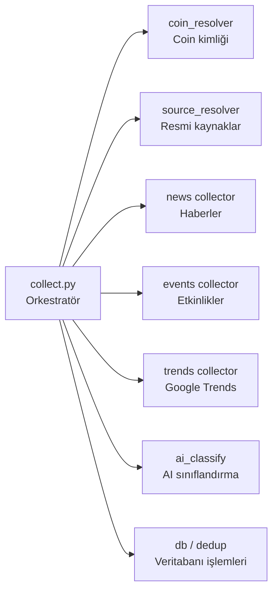
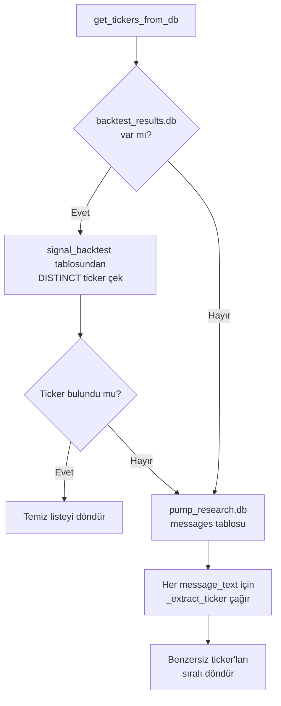
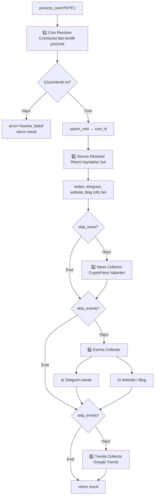
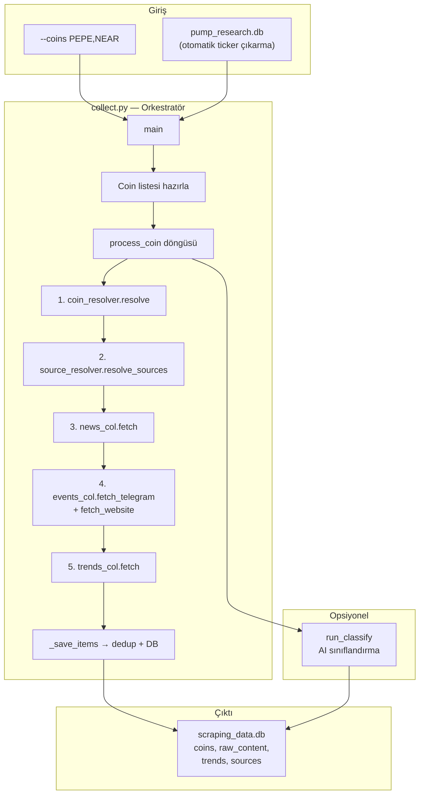

# 🏭 [collect.py](file:///c:/Users/bayra/Desktop/tel-pipline-scraping/scraping/collect.py) — Detaylı Kod Açıklaması

Bu dosya, tüm scraping pipeline'ının **orkestratörüdür** (yöneticisi). Coin listesini alır, her coin için sırayla veri toplar, veritabanına kaydeder ve opsiyonel olarak AI sınıflandırma geçişi çalıştırır.

---

## 📦 1. Modül Docstring'i (Satır 1–21)

```python
"""
Scraping Toplu Islemci (collect.py)
=====================================
Elimizdeki coinler icin tum scraping islemlerini sirayla calistirir.

Akis:
  1. Coin listesini al (pump_research.db'den veya --coins argumani)
  2. Her coin icin:
       a. CoinResolver  → kimlik + market cap
       b. SourceResolver → resmi kaynaklar (twitter, telegram, website, blog)
       c. NewsCollector  → CryptoPanic haberleri
       d. EventsCollector→ Telegram / Nitter / website duyurulari
       e. TrendsCollector→ Google Trends 7 gunluk veri
  3. Opsiyonel: --classify ile AI siniflandirma gecisi
"""
```

Tüm pipeline akışını özetleyen docstring. Kullanım örnekleri de içerir:
- `python -m scraping.collect` → Varsayılan ayarlarla çalıştır
- `--coins PEPE,NEAR,AVAX` → Manuel coin listesi
- `--classify` → Sonunda AI sınıflandırma da yap
- `--skip-news --skip-trends` → Belirli adımları atla

---

## 📥 2. Import'lar (Satır 23–49)

### Standart Kütüphane Import'ları (Satır 23–30)

```python
import argparse
import logging
import os
import re
import sqlite3
import sys
import time
from pathlib import Path
```

| Modül | Ne İşe Yarıyor |
|-------|----------------|
| `argparse` | Komut satırı argümanlarını parse etmek (CLI) |
| `logging` | Log mesajları üretmek |
| `os` | Çevre değişkenleri okumak (`CRYPTOPANIC_TOKEN` vb.) |
| [re](file:///c:/Users/bayra/Desktop/tel-pipline-scraping/scraping/coin_resolver.py#24-87) | Regex ile ticker çıkarmak |
| `sqlite3` | SQLite veritabanı işlemleri |
| `sys` | `sys.exit()` ile programı sonlandırmak |
| `time` | API çağrıları arasında bekleme |
| `Path` | Dosya yollarını platform-bağımsız yönetmek |

### `.env` Dosyası Yükleme (Satır 32–41)

```python
try:
    from dotenv import load_dotenv
    _env_file = Path(__file__).parent.parent / ".env"
    if _env_file.exists():
        load_dotenv(_env_file)
    else:
        load_dotenv()
except ImportError:
    pass
```

| İşlem | Açıklama |
|-------|----------|
| `Path(__file__).parent.parent` | Bu dosyanın iki üst dizini (proje kökü) |
| `load_dotenv(_env_file)` | `.env` dosyasındaki değişkenleri çevre değişkeni olarak yükler |
| `except ImportError: pass` | `python-dotenv` kurulu değilse sessizce geçer |

> [!TIP]
> `.env` dosyası, API anahtarları gibi gizli bilgileri koddan ayırmak için kullanılır. `load_dotenv()` bu dosyayı okuyup `os.environ`'a ekler. Böylece `os.environ.get("OPENAI_API_KEY")` çalışır.

### Proje Modül Import'ları (Satır 43–49)

```python
from scraping import db as scrapdb
from scraping import coin_resolver, source_resolver, dedup
from scraping.collectors import news as news_col
from scraping.collectors import events as events_col
from scraping.collectors import trends as trends_col
from scraping.ai_classify import classify_batch
```

Bu import'lar pipeline'ın **bileşenlerini** yükler:



---

## 📊 3. Logging Ayarı (Satır 55–60)

```python
logging.basicConfig(
    level=logging.INFO,
    format="%(asctime)s [%(levelname)s] %(name)s: %(message)s",
    datefmt="%H:%M:%S",
)
log = logging.getLogger("collect")
```

| Parametre | Değer | Açıklama |
|-----------|-------|----------|
| `level` | `INFO` | INFO ve üzeri (WARNING, ERROR) gösterilir |
| `format` | `"%(asctime)s [%(levelname)s]..."` | Log formatı: `14:30:25 [INFO] collect: mesaj` |
| `datefmt` | `"%H:%M:%S"` | Saat:Dakika:Saniye formatı |

---

## 🔤 4. Gürültü Seti ve Ticker Çıkarma (Satır 67–95)

### `_NOISE` Seti (Satır 68–74)

```python
_NOISE = {
    "VIP","TP","SL","USD","THE","FOR","NEW","ALL","NOW","TOP","GET",
    "NOT","ARE","YOU","HAS","ITS","DAY","OUR","MAX","USE","HOW","API",
    ...
}
```

Bu set, ticker gibi görünen ama **aslında coin olmayan** kelimeleri filtreler. Örneğin:
- `"TP"` → Take Profit (al sat terimi), coin değil
- `"SL"` → Stop Loss, coin değil
- `"USD"` → Dolar, coin değil
- `"AI"` → Yapay zeka kısaltması, coin değil
- `"NFT"`, `"ETF"` → Genel terimler

> [!NOTE]
> Python'da `set` (küme) kullanılması önemli: [in](file:///c:/Users/bayra/Desktop/tel-pipline-scraping/scraping/collect.py#439-583) operatörü set'te **O(1)** (sabit süre) çalışırken, listede **O(n)** (liste boyutuyla orantılı) çalışır. Sık kontrol edilen büyük koleksiyonlar için set tercih edilir.

### `_TICKER_PATTERNS` — Regex Desenleri (Satır 77–84)

```python
_TICKER_PATTERNS = [
    r"#([A-Z]{2,10}/USDT)",      # #PEPE/USDT
    r"#([A-Z]{2,10}USDT)",       # #PEPEUSDT
    r"Coin\s*:\s*#?([A-Z]{2,10})", # Coin: #PEPE veya Coin: PEPE
    r"\$([A-Z]{2,10})\b",        # $PEPE
    r"\b([A-Z]{2,10})/USDT\b",   # PEPE/USDT
    r"^([A-Z]{2,5})\b",          # Satır başında PEPE
]
```

Her deseni açıklayalım:

| Regex | Eşleşme Örneği | Açıklama |
|-------|----------------|----------|
| `#([A-Z]{2,10}/USDT)` | `#PEPE/USDT` | Hashtag + sembol + /USDT |
| `#([A-Z]{2,10}USDT)` | `#PEPEUSDT` | Hashtag + sembol + USDT (birleşik) |
| `Coin\s*:\s*#?([A-Z]{2,10})` | `Coin: PEPE` | "Coin:" + sembol |
| `\$([A-Z]{2,10})\b` | `$PEPE` | Dolar işareti + sembol (cashtag) |
| `\b([A-Z]{2,10})/USDT\b` | `PEPE/USDT` | Sembol + /USDT (hashsiz) |
| `^([A-Z]{2,5})\b` | `PEPE ...` | Satır başında 2-5 harfli büyük kelime |

**Regex temel kavramları:**

| Sembol | Anlamı |
|--------|--------|
| `[A-Z]` | Herhangi bir büyük harf |
| `{2,10}` | 2 ile 10 kez tekrarla |
| [(...)](file:///c:/Users/bayra/Desktop/tel-pipline-scraping/scraping/collect.py#439-583) | Yakalama grubu — eşleşen kısmı `m.group(1)` ile alır |
| `\b` | Kelime sınırı (word boundary) |
| `^` | Satır başı |
| `\s*` | Sıfır veya daha fazla boşluk |
| `#?` | Sıfır veya bir adet `#` |

### [_extract_ticker](file:///c:/Users/bayra/Desktop/tel-pipline-scraping/scraping/collect.py#87-96) Fonksiyonu (Satır 87–95)

```python
def _extract_ticker(message_text: str) -> str | None:
    for pat in _TICKER_PATTERNS:
        m = re.search(pat, message_text)
        if m:
            t = m.group(1).replace("/USDT", "").replace("USDT", "")
            if len(t) >= 2 and t not in _NOISE:
                return t
    return None
```

**Akış:**
1. Her regex desenini sırayla dener.
2. İlk eşleşmede yakalama grubunu alır.
3. `/USDT` ve `USDT` eklentilerini temizler → saf sembol kalır.
4. 2+ karakter uzunluğunda ve gürültü listesinde değilse → ticker olarak döner.
5. Hiçbir desen eşleşmezse `None` döner.

> [!IMPORTANT]
> Desenler **öncelik sırasına** göre dizilmiştir. `#PEPE/USDT` gibi kesin desenler önce, `^PEPE` gibi belirsiz desenler sonda. Bu sayede en güvenilir eşleşme önce alınır.

---

## 🗄️ 5. Ticker'ları Veritabanından Çekme: [get_tickers_from_db](file:///c:/Users/bayra/Desktop/tel-pipline-scraping/scraping/collect.py#98-152) (Satır 98–151)

```python
def get_tickers_from_db(src_db: str) -> list[str]:
```

İki kaynaktan ticker çeker, birincisi önceliklidir:



### Kaynak 1: `backtest_results.db` (Satır 110–127)

```python
bt_db = Path(src_db).parent / "backtest_results.db"
if bt_db.exists():
    conn = sqlite3.connect(str(bt_db))
    cur = conn.execute("""
        SELECT DISTINCT UPPER(TRIM(ticker))
        FROM signal_backtest
        WHERE ticker IS NOT NULL AND TRIM(ticker) != ''
        ORDER BY 1
    """)
    tickers = [row[0] for row in cur.fetchall()]
```

| SQL Terimi | Açıklama |
|------------|----------|
| `DISTINCT` | Tekrarları kaldırır |
| `UPPER(TRIM(...))` | Boşlukları temizle + büyük harfe çevir |
| `WHERE ticker IS NOT NULL` | Boş olmayanları al |
| `ORDER BY 1` | İlk sütuna göre sırala (A-Z) |

### Kaynak 2: Message Text'ten Regex ile (Satır 129–151)

```python
found = set()
for (msg,) in rows:
    t = _extract_ticker(msg)
    if t:
        found.add(t)
tickers = sorted(found)
```

- `set()` → Otomatik tekrar engelleme (aynı ticker birden fazla mesajda geçebilir).
- [(msg,)](file:///c:/Users/bayra/Desktop/tel-pipline-scraping/scraping/collect.py#439-583) → Tuple unpacking. SQL sorgusu tek sütun döndüğünde `row = ("mesaj metni",)` şeklinde gelir. [(msg,)](file:///c:/Users/bayra/Desktop/tel-pipline-scraping/scraping/collect.py#439-583) ile ilk elemanı `msg`'ye atar.
- `sorted(found)` → A-Z sıralı liste döner.

---

## 💾 6. İçerik Kaydetme: [_save_items](file:///c:/Users/bayra/Desktop/tel-pipline-scraping/scraping/collect.py#158-178) (Satır 158–177)

```python
def _save_items(out_db: str, coin_id: int, items: list[dict]) -> int:
```

Collector'lardan gelen ham verileri **dedup hash**'leyerek veritabanına kaydeder.

```python
for item in items:
    if "url_hash" not in item or "title_hash" not in item:
        hashes = dedup.compute_hashes(
            item.get("url", ""),
            item.get("title", ""),
        )
        item.update(hashes)

    result = scrapdb.save_content(out_db, coin_id, item)
    if result is not None:
        saved += 1
```

| Adım | Açıklama |
|------|----------|
| Hash kontrolü | URL ve başlık için hash hesaplanmış mı? |
| `dedup.compute_hashes()` | Aynı içeriğin tekrar kaydedilmesini önleyen hash üretir |
| `item.update(hashes)` | Hash'leri item dict'ine ekler |
| `scrapdb.save_content()` | Veritabanına kaydet. Zaten varsa `None` döner |
| `result is not None` | Yeni kayıt eklendiyse sayacı artır |

> [!TIP]
> **Deduplication (Tekrar Engelleme)**: Aynı haberi farklı kaynaklardan çekebilirsiniz. URL veya başlık hash'i aynıysa, ikinci kayıt DB'ye eklenmez. Bu, veri kalitesini artıran önemli bir mekanizmadır.

---

## 🪙 7. Tek Coin İşlemi: [process_coin](file:///c:/Users/bayra/Desktop/tel-pipline-scraping/scraping/collect.py#184-328) (Satır 184–327)

Bu fonksiyon **tek bir coin** için tüm scraping adımlarını çalıştırır. Pipeline'ın kalbidir.

```python
def process_coin(symbol: str, out_db: str, cfg: dict) -> dict:
```

### Sonuç Dict (Satır 203–211)

```python
result = {
    "symbol":    symbol,
    "resolved":  False,
    "coin_id":   None,
    "news":      0,
    "events":    0,
    "trends":    0,
    "error":     None,
}
```

Her coin'in işlem sonucu bu dict'te takip edilir. Bu, sonraki özet rapor için bilgi toplar.

### Pipeline Akışı



### Adım 1: Coin Resolver (Satır 213–224)

```python
coin = coin_resolver.resolve(symbol)
if not coin:
    result["error"] = "resolve_failed"
    return result

coin_id = scrapdb.upsert_coin(out_db, coin)
```

- [resolve()](file:///c:/Users/bayra/Desktop/tel-pipline-scraping/scraping/coin_resolver.py#24-87) → CoinGecko'dan coin bilgisi çeker (önceki dosyada anlattık).
- `upsert_coin()` → **UPSERT** = UPDATE + INSERT. Coin zaten DB'deyse güncelle, yoksa ekle.

### Adım 2: Source Resolver (Satır 226–241)

```python
sources = source_resolver.resolve_sources(coin["coingecko_id"])
if sources:
    scrapdb.save_sources(out_db, coin_id, sources)
```

Coin'in resmi kaynaklarını (Twitter, Telegram, website, blog) bulur ve kaydeder. Bu URL'ler sonraki adımlarda içerik çekmek için kullanılır.

### Adım 3: News Collector (Satır 243–257)

```python
if not cfg.get("skip_news"):
    news_items = news_col.fetch(
        symbol=symbol,
        auth_token=token,
        pages=cfg.get("news_pages", 3),
    )
    saved = _save_items(out_db, coin_id, news_items)
```

- CryptoPanic API'sinden haberleri çeker.
- `cfg.get("skip_news")` → Kullanıcı `--skip-news` verdiyse bu adım atlanır.
- `pages=3` → Varsayılan 3 sayfa haber (her sayfada ~20 haber).

### Adım 4: Events Collector (Satır 259–303)

İki alt kaynağı vardır:

**a) Telegram Kanalı (Satır 264–284)**
```python
if tg_url and tg_api_id and tg_api_hash:
    tg_items = events_col.fetch_telegram(
        telegram_url=tg_url,
        api_id=tg_api_id,
        api_hash=tg_api_hash,
    )
    event_items.extend(tg_items)
elif tg_url:
    log.warning("Telegram URL var ama API bilgileri yok...")
```

Üç koşul aynı anda sağlanmalı: URL + API ID + API Hash. Biri eksikse uyarı verir, çökmez.

**b) Website / Blog (Satır 286–298)**
```python
if website or blog:
    web_items = events_col.fetch_website(
        website_url=website,
        blog_url=blog,
    )
    event_items.extend(web_items)
```

### Adım 5: Trends Collector (Satır 305–325)

```python
if not cfg.get("skip_trends"):
    trends_wait = cfg.get("trends_pre_delay", 30)
    time.sleep(trends_wait)
    trend_points = trends_col.fetch(symbol=symbol, name=name)
```

**30 saniye ön-bekleme** → Google Trends çok sıkı rate limit uygular. Her coin öncesinde beklenme yapılır.

```python
kw_groups: dict[str, list] = {}
for pt in trend_points:
    kw_groups.setdefault(pt["keyword"], []).append(
        {"date": pt["date"], "value": pt["value"]}
    )
for kw, series in kw_groups.items():
    scrapdb.save_trends(out_db, coin_id, kw, series)
```

**`setdefault` deseni**: Dict'te key yoksa oluştur + varsayılan değer ata, sonra değer ekle. Bu, gruplama işlemi için kullanışlı bir kısayoldur.

```python
# Uzun versiyon:
if pt["keyword"] not in kw_groups:
    kw_groups[pt["keyword"]] = []
kw_groups[pt["keyword"]].append(...)

# Kısa versiyon (aynı iş):
kw_groups.setdefault(pt["keyword"], []).append(...)
```

---

## 🤖 8. AI Sınıflandırma: [run_classify](file:///c:/Users/bayra/Desktop/tel-pipline-scraping/scraping/collect.py#334-433) (Satır 334–432)

```python
def run_classify(out_db: str, coin_ids: list[int] = None):
```

Daha önce toplanan ham içerikleri AI ile sınıflandırır.

### Adım 1: Kolon Ekleme (Satır 344–362)

```python
classify_columns = [
    ("is_relevant",  "INTEGER"),
    ("content_type", "TEXT"),
    ("sentiment",    "TEXT"),
    ...
]
for col_name, col_type in classify_columns:
    try:
        conn.execute(f"ALTER TABLE raw_content ADD COLUMN {col_name} {col_type}")
    except Exception:
        pass  # Kolon zaten var
```

**Schema Migration (Şema Göçü)**: Yeni kolonlar tabloya eklenir. Zaten varsa hata yakalanıp sessizce geçilir. Bu, geriye dönük uyumluluğu sağlar — eski DB'ler bile çalışır.

> [!NOTE]
> **`ALTER TABLE ... ADD COLUMN`**: SQLite'ta bir tabloya yeni sütun ekler. Mevcut satırlarda bu sütun `NULL` olur. `try/except` ile sarmalanması, çoklu çalıştırmada hata almamanızı sağlar.

### Adım 2: Sınıflandırılmamış İçerikleri Çek (Satır 364–381)

```python
query = """
    SELECT rc.id, rc.coin_id, rc.title, rc.body, c.symbol, c.name
    FROM raw_content rc
    JOIN coins c ON rc.coin_id = c.id
    WHERE rc.is_relevant IS NULL
"""
if coin_ids:
    placeholders = ",".join("?" * len(coin_ids))
    query += f" AND rc.coin_id IN ({placeholders})"
    params.extend(coin_ids)
```

| SQL Kavramı | Açıklama |
|-------------|----------|
| `JOIN ... ON` | İki tabloyı birleştirir (coin adını almak için) |
| `WHERE is_relevant IS NULL` | Henüz sınıflandırılmamış satırlar |
| `IN (?, ?, ?)` | Parametrik sorgu (SQL injection koruması) |

> [!IMPORTANT]
> **Parametrik sorgular** (`?` placeholder'ları): Değerleri doğrudan SQL string'ine yazmak yerine `?` ile parametre geçmek **SQL Injection saldırılarını** önler. Güvenli veritabanı programlamanın temel kuralıdır.

### Adım 3: Coin'e Göre Gruplama (Satır 389–395)

```python
from collections import defaultdict
coin_groups: dict = defaultdict(list)
for row in rows:
    coin_groups[(row["coin_id"], row["symbol"], row["name"])].append(
        {"id": row["id"], "title": row["title"], "body": row["body"]}
    )
```

- **`defaultdict(list)`**: Olmayan key'e erişildiğinde otomatik boş liste oluşturur.
- **Tuple key**: [(coin_id, symbol, name)](file:///c:/Users/bayra/Desktop/tel-pipline-scraping/scraping/collect.py#439-583) → Aynı coin'in tüm içerikleri aynı grup altında toplanır.
- Her gruba ait içerikler tek seferde AI'ya gönderilir (aynı coin hakkındaki içerikler birlikte değerlendirilir).

### Adım 4: Sonuçları DB'ye Yazma (Satır 402–430)

```python
for cls in classifications:
    conn2.execute("""
        UPDATE raw_content SET
            is_relevant  = ?,
            content_type = ?,
            sentiment    = ?,
            ...
        WHERE id = ?
    """, (
        1 if cls.get("is_relevant") else 0,
        cls.get("content_type"),
        ...
        content_id,
    ))
```

- `1 if cls.get("is_relevant") else 0` → Boolean'ı integer'a çevirir (SQLite'ta boolean yok).
- Her içerik satırı AI sonuçlarıyla güncellenir.

---

## ⚙️ 9. CLI ve Ana Akış: [main](file:///c:/Users/bayra/Desktop/tel-pipline-scraping/scraping/collect.py#439-583) (Satır 439–618)

### Argparse — Komut Satırı Arayüzü (Satır 440–502)

```python
parser = argparse.ArgumentParser(
    description="Coin bazli scraping toplu islemcisi",
    formatter_class=argparse.RawDescriptionHelpFormatter,
)
```

| Argüman | Tip | Varsayılan | Açıklama |
|---------|-----|------------|----------|
| `--coins` | `str` | `None` | Manuel ticker listesi: `PEPE,NEAR,AVAX` |
| `--db` | `str` | `pump_research.db` | Kaynak veritabanı |
| `--out-db` | `str` | `scraping_data.db` | Çıktı veritabanı |
| `--classify` | flag | `False` | Scraping sonrası AI sınıflandırma yap |
| `--classify-only` | flag | `False` | Sadece sınıflandırma yap (scraping yok) |
| `--skip-news` | flag | `False` | Haber çekimini atla |
| `--skip-events` | flag | `False` | Etkinlik çekimini atla |
| `--skip-trends` | flag | `False` | Trends çekimini atla |
| `--news-pages` | [int](file:///c:/Users/bayra/Desktop/tel-pipline-scraping/scraping/collect.py#585-591) | `3` | Kaç sayfa haber çekilecek |
| `--delay` | `float` | `2.0` | Coinler arası bekleme (sn) |
| `--trends-delay` | `float` | `30.0` | Google Trends ön-bekleme (sn) |
| `--verbose` | flag | `False` | DEBUG seviyesinde log |

> [!NOTE]
> **`action="store_true"`**: Argüman verildiğinde `True` olur, verilmediğinde `False`. Bayrak (flag) argümanları için kullanılır. Değer almaz, yalnızca var/yok durumu önemlidir.

### Coin Listesi Hazırlama (Satır 517–525)

```python
if args.coins:
    symbols = [s.strip().upper() for s in args.coins.split(",") if s.strip()]
else:
    symbols = get_tickers_from_db(args.db)
    if not symbols:
        log.error("Ticker bulunamadi. --coins ile manuel belirtin.")
        sys.exit(1)
```

İki kaynak:
1. `--coins PEPE,NEAR` → Virgülle ayrılmış string'i listeye çevirir.
2. Argüman yoksa → Veritabanından otomatik çeker. Hiç bulamazsa program çıkar.

### Config Dict Hazırlama (Satır 527–537)

```python
cfg = {
    "skip_news":          args.skip_news,
    "skip_events":        args.skip_events,
    "skip_trends":        args.skip_trends,
    "news_pages":         args.news_pages,
    "trends_pre_delay":   args.trends_delay,
    "cryptopanic_token":  os.environ.get("CRYPTOPANIC_TOKEN"),
    "telegram_api_id":    _int_env("TELEGRAM_API_ID"),
    "telegram_api_hash":  os.environ.get("TELEGRAM_API_HASH"),
}
```

Tüm konfigürasyon tek bir dict'te toplanır ve [process_coin](file:///c:/Users/bayra/Desktop/tel-pipline-scraping/scraping/collect.py#184-328)'e geçilir. Bu, parametre sayısının büyümesini önler (**config object pattern**).

### Ana İşlem Döngüsü (Satır 561–571)

```python
for idx, symbol in enumerate(symbols, 1):
    print(f"\n[{idx}/{len(symbols)}] ── {symbol} ──")
    summary = process_coin(symbol, out_db, cfg)
    summaries.append(summary)
    if summary.get("coin_id"):
        processed_coin_ids.append(summary["coin_id"])
    if idx < len(symbols):
        time.sleep(args.delay)
```

Her coin sırayla işlenir. Arada `--delay` kadar beklenir (CoinGecko rate limit).

---

## 🔧 10. Yardımcı Fonksiyonlar (Satır 585–627)

### [_int_env](file:///c:/Users/bayra/Desktop/tel-pipline-scraping/scraping/collect.py#585-591) (Satır 585–590)

```python
def _int_env(key: str) -> int | None:
    val = os.environ.get(key)
    try:
        return int(val) if val else None
    except ValueError:
        return None
```

Çevre değişkenini **integer'a** çevirir. Hatalı değerde `None` döner, çökmez.

### [_print_summary](file:///c:/Users/bayra/Desktop/tel-pipline-scraping/scraping/collect.py#593-619) (Satır 593–618)

```python
def _print_summary(summaries: list[dict], elapsed: float, out_db: str):
    resolved  = sum(1 for s in summaries if s["resolved"])
    failed    = sum(1 for s in summaries if not s["resolved"])
    total_news   = sum(s["news"]   for s in summaries)
    ...
```

İşlem sonunda terminal'e güzel formatlanmış bir özet basar:

```
============================================================
  SCRAPING TAMAMLANDI
============================================================
  Toplam coin  : 5
  Cozumlendi   : 4
  Basarisiz    : 1
  Haberler     : 45
  Etkinlikler  : 12
  Trends nokt. : 28
  Sure         : 142.5s
  Cikti DB     : scraping_data.db

  Basarisiz coinler:
    - FAKECOIN (resolve_failed)
============================================================
```

> [!TIP]
> **Generator expression**: [sum(1 for s in summaries if s["resolved"])](file:///c:/Users/bayra/Desktop/tel-pipline-scraping/scraping/collect.py#593-619) ifadesi, `resolved=True` olan elemanları sayar. Bellek dostu çalışır — önce liste oluşturmaz, her elemanı tek tek işler.

### Entry Point (Satır 625–626)

```python
if __name__ == "__main__":
    main()
```

Bu dosya doğrudan çalıştırıldığında [main()](file:///c:/Users/bayra/Desktop/tel-pipline-scraping/scraping/collect.py#439-583) fonksiyonunu çağırır. Başka dosyadan import edildiğinde çalışmaz.

---

## 🏗️ Genel Pipeline Mimarisi



---

## 🎯 Öğrenilen Tasarım Desenleri ve Kavramlar

| Desen / Kavram | Nerede Kullanılıyor | Neden Önemli |
|----------------|---------------------|--------------|
| **Orchestrator Pattern** | [process_coin](file:///c:/Users/bayra/Desktop/tel-pipline-scraping/scraping/collect.py#184-328), [main](file:///c:/Users/bayra/Desktop/tel-pipline-scraping/scraping/collect.py#439-583) | Tüm bileşenleri koordine eden merkezi kontrol |
| **Config Object** | `cfg` dict | Parametre patlamasını önler, tek yerde yönetilir |
| **Graceful Degradation** | Her adımda `try/except` | Bir adım başarısız olursa diğerleri çalışmaya devam eder |
| **Deduplication** | [_save_items](file:///c:/Users/bayra/Desktop/tel-pipline-scraping/scraping/collect.py#158-178) + hash | Aynı içeriğin tekrar kaydedilmesini önler |
| **Schema Migration** | `ALTER TABLE ... ADD COLUMN` | Eski DB'ler yeni kolonlarla uyumlu çalışır |
| **Parametric Queries** | `WHERE coin_id IN (?, ?)` | SQL injection koruması |
| **Noise Filtering** | `_NOISE` set | Yanlış pozitif ticker eşleşmelerini engeller |
| **Priority-based Regex** | `_TICKER_PATTERNS` sırası | En güvenilir desen önce denenir |
| **Rate Limiting** | `time.sleep()` çağrıları | API sınırlarına uyum sağlar |
| **UPSERT** | `scrapdb.upsert_coin()` | Var olanı güncelle, yoksa ekle |
| **defaultdict** | `defaultdict(list)` gruplama | Key kontrolü yapmadan gruplama |
| **Generator Expression** | [sum(1 for s in ...)](file:///c:/Users/bayra/Desktop/tel-pipline-scraping/scraping/collect.py#593-619) | Bellek dostu sayma işlemi |
